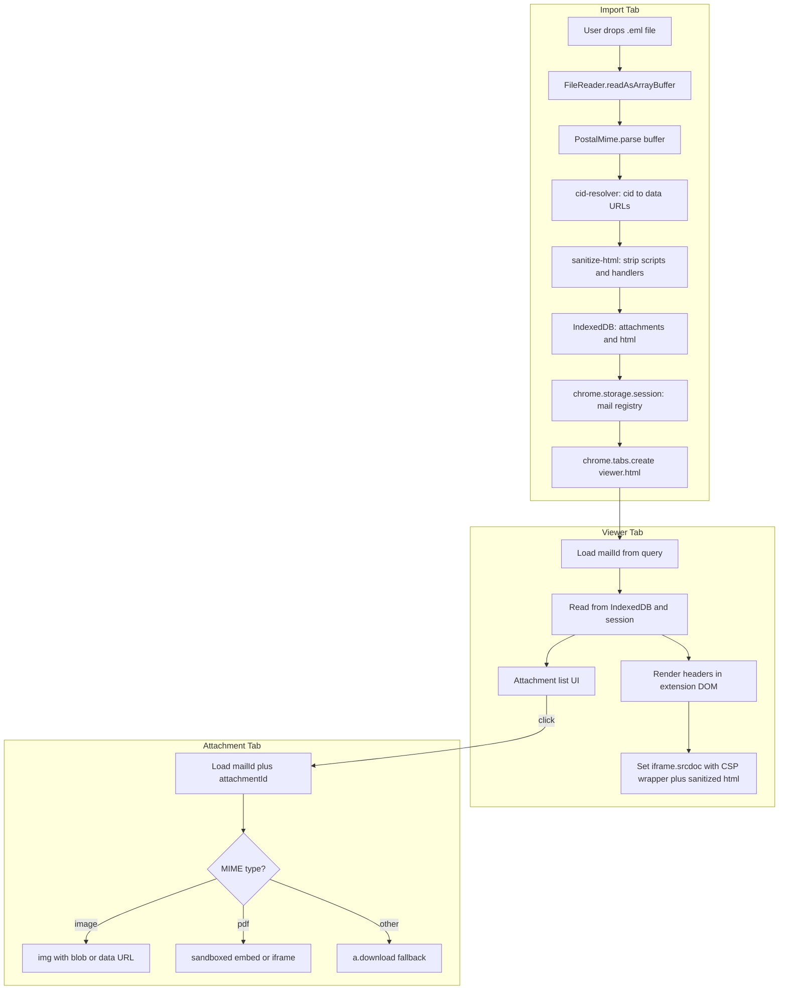

# EML Viewer Chrome Extension — Execution Plan

## Decisions Locked In

| Decision | Choice |
|----------|--------|
| Primary UI | Dedicated **extension tab** (`viewer.html`) opened after import |
| Attachments | **Full v1**: CID inline images in body + clickable list; images/PDFs open in new tab; other types download |
| Parser | [`postal-mime`](https://github.com/postalsys/postal-mime) (browser-native, zero deps, `ArrayBuffer` input) |
| Bundler | **Vite** + `@crxjs/vite-plugin` — required because `postal-mime` is ESM and MV3 extension pages need a proper build pipeline |
| Network | **No `host_permissions`** for email/remote content — external URLs in email HTML cannot load (tracking pixels blocked). **Telemetry Phase B** will add one scoped ingest URL only (see §8). |

---

## 1. Project Directory Tree

```
platformeq-eml-converter/
├── package.json
├── vite.config.js                 # @crxjs/vite-plugin, multi-page entries
├── manifest.json                  # source manifest (CRXJS merges built assets)
├── public/
│   └── icons/
│       ├── icon-16.png
│       ├── icon-48.png
│       └── icon-128.png
├── src/
│   ├── background/
│   │   └── service-worker.js      # tab routing, startup IDB↔session reconciliation, TTL prune
│   ├── pages/
│   │   ├── import/
│   │   │   ├── import.html        # drop zone + file picker (entry on icon click)
│   │   │   ├── import.css
│   │   │   └── import.js
│   │   ├── debug/
│   │   │   ├── telemetry.html     # local telemetry queue inspector (QA)
│   │   │   ├── telemetry.css
│   │   │   └── telemetry.js
│   │   ├── viewer/
│   │   │   ├── viewer.html        # main email reader tab
│   │   │   ├── viewer.css
│   │   │   └── viewer.js
│   │   └── attachment/
│   │       ├── attachment.html    # attachment preview tab
│   │       ├── attachment.css
│   │       └── attachment.js
│   ├── lib/
│   │   ├── parse-eml.js           # PostalMime.parse wrapper + options
│   │   ├── cid-resolver.js        # cid: → data: URL mapping
│   │   ├── sanitize-html.js       # DOMParser-based strip of active content (no deps)
│   │   ├── storage.js             # IndexedDB + chrome.storage.session bridge
│   │   ├── mail-session.js        # mailId generation, TTL, cleanup
│   │   ├── telemetry.js           # usage event queue, bucketing, content fingerprint
│   │   └── constants.js           # DB names, MIME allowlists
│   └── styles/
│       └── shared.css             # typography, layout tokens (no framework)
└── dist/                          # built extension (load unpacked from here)
```

**Why three pages?** Each maps to a distinct tab lifecycle: import (ingest), viewer (read email), attachment (preview one blob). Query params (`?mailId=…&attachmentId=…`) keep URLs small; binary data stays in IndexedDB.

---

## 2. Manifest V3 Configuration Plan

### Permissions (minimal)

```json
{
  "manifest_version": 3,
  "name": "PlatformEQ EML Viewer",
  "version": "0.1.0",
  "description": "Private local .eml file viewer",
  "permissions": ["storage", "identity", "identity.email"],
  "action": {
    "default_title": "Open EML Viewer",
    "default_icon": { "16": "icons/icon-16.png", "48": "icons/icon-48.png" }
  },
  "background": {
    "service_worker": "src/background/service-worker.js",
    "type": "module"
  },
  "icons": { "16": "...", "48": "...", "128": "..." }
}
```

- **`storage`**: enables `chrome.storage.session` for lightweight mail registry (IDs, subjects, attachment index) and `chrome.storage.local` for the telemetry queue. IndexedDB does not need a permission.
- **`identity` / `identity.email`**: read work email from Chrome profile for identified usage telemetry (Okta→Google Scenario A). No Okta API in the extension.
- **No `host_permissions` (Phase A)**: deliberate — extension cannot fetch arbitrary `https://…` URLs. Phase B adds one scoped Cloud Run ingest host only.
- **No `tabs` permission**: `chrome.tabs.create({ url })` works without it when opening extension-owned URLs.

### Entry point → import tab

In `service-worker.js`, wire toolbar click to open the import page:

```javascript
chrome.action.onClicked.addListener(() => {
  chrome.tabs.create({ url: chrome.runtime.getURL('src/pages/import/import.html') });
});
```

(After build, CRXJS rewrites paths to `dist/…`.)

### Content Security Policy

MV3 applies a strict default CSP to extension pages (`script-src 'self'`). Do **not** weaken it. All JS must be bundled/local. **Never** inject raw email HTML into the extension DOM — only into the sandbox iframe `srcdoc`.

### Sandboxing strategy (two layers)

**Layer A — manifest sandbox pages (optional, not required for core flow):** You can declare `"sandbox": { "pages": ["sandbox.html"] }` for pages with no extension API access. For this project, **inline iframe sandboxing on viewer/attachment pages is sufficient** and simpler.

**Layer B — email body iframe (required):**

```html
<iframe
  id="email-body"
  sandbox="allow-popups allow-popups-to-escape-sandbox"
  title="Email body"
></iframe>
```

- **Why not `sandbox=""`?** A fully empty sandbox blocks popups and top-navigation, which means **links in the email body are dead** — `target="_blank"` is inert. For an email viewer, that ruins the core read flow (confirmation links, unsubscribe, shared docs).
- `allow-popups allow-popups-to-escape-sandbox` lets a clicked link open in a **real new tab**, while still keeping the critical defenses:
  - **No `allow-scripts`** → JavaScript in the body cannot execute.
  - **No `allow-same-origin`** → the frame keeps an **opaque origin** (no cookie/storage access, no same-origin reach into the extension).
  - **No `allow-forms`** → form submissions blocked.
  - **No `allow-top-navigation`** → the email cannot hijack the viewer tab itself.
- Escaped popups open as a normal top-level browsing context with **no opener** back to the sandboxed frame, so there is no `window.opener` leak.
- Set content via **`srcdoc`**, not `blob:` URLs tied to email origin (keeps opaque origin).

**Layer C — `srcdoc` CSP meta** (blocks subresource network even if HTML references external URLs):

```html
<meta http-equiv="Content-Security-Policy"
      content="default-src 'none'; img-src data:; style-src 'unsafe-inline';">
```

External `https://tracking-pixel…` images fail to load because (1) no host permissions and (2) CSP `img-src data:` only allows inline CID-resolved images.

### `web_accessible_resources`

Not needed unless you load sub-resources by `chrome-extension://` URL from inside the iframe. With `srcdoc` + `data:` images, **omit WAR** to reduce attack surface.

---

## 3. Parsing & Security Pipeline



### Step-by-step logic

1. **File ingest** (`import.js`)
   - Accept `.eml` via `<input type="file" accept=".eml">` and drag-and-drop.
   - Validate: extension, max size (recommend 25–50 MB cap to protect memory).
   - `const buffer = await file.arrayBuffer()`.

2. **Parse** (`parse-eml.js`)
   - `const email = await PostalMime.parse(buffer, { attachmentEncoding: 'arraybuffer' })`.
   - Yields: `headers`, `from`, `to`, `cc`, `subject`, `date`, `html`, `text`, `attachments[]` with `contentId`, `related`, `mimeType`, `content`.

3. **CID resolution** (`cid-resolver.js`)
   - Build map: `contentId (normalized, strip angle brackets) → data: URL`.
   - For each inline/related attachment with `contentId`, encode `ArrayBuffer` as base64 `data:${mimeType};base64,…`.
   - Regex-replace `cid:…` references in HTML (`src`, `background`, `url()` in inline styles where practical).
   - If HTML missing, wrap `text` in `<pre>` for display.

4. **Sanitize** (`sanitize-html.js`) — defense in depth **before** iframe
   - **DOM-tree based, never regex.** Parse with `DOMParser.parseFromString(html, 'text/html')`, mutate the tree, then re-serialize `doc.body.innerHTML`. Regex on HTML strings is the classic sanitizer footgun (mutation-XSS, foreign-content `<svg>`/`<math>` tricks, attribute-boundary escapes) — do not do it.
   - Remove elements: `<script>`, `<iframe>`, `<object>`, `<embed>`, `<link>`, `<base>`, `<meta>` (esp. `http-equiv=refresh`).
   - Walk **every** element and remove all `on*` event-handler attributes; strip `javascript:` (and other non-http(s)/`data:`/`cid:`) URL schemes from `href`/`src`/`action`/etc.
   - Neutralize `<form>` elements (unwrap or strip `action`).
   - **No dependency** — implemented with the platform `DOMParser`, consistent with the zero-dep design.
   - This is **belt-and-suspenders, not the boundary**: the `sandbox` iframe (no `allow-scripts`) is what actually guarantees scripts can't run. Sanitization reduces surface and cleans rendering; never rely on it alone.

5. **Persist locally** (`storage.js` + `mail-session.js`)
   - Generate `mailId` (e.g. `crypto.randomUUID()`).
   - **IndexedDB** store:
     - `mails`: `{ mailId, subject, from, to, cc, date, htmlSanitized, text, createdAt }`
     - `attachments`: `{ mailId, attachmentId, filename, mimeType, disposition, related, contentId, blob }`
   - **`chrome.storage.session`**: `{ mailId, subject, from, date, attachmentIds: [...] }` for fast viewer bootstrap.
   - Session-scoped data auto-clears when browser closes — good for internal privacy.

6. **Open viewer tab**
   - `chrome.tabs.create({ url: `viewer.html?mailId=${mailId}` })`.
   - Close or keep import tab (user preference; default keep for multi-file import later).

7. **Render in viewer** (`viewer.js`)
   - Extension DOM: header block (from, to, subject, date) — safe structured text, no raw HTML.
   - Body: build `srcdoc` document:
     ```javascript
     const srcdoc = `<!DOCTYPE html>
     <html><head>
       <meta http-equiv="Content-Security-Policy" content="default-src 'none'; img-src data:; style-src 'unsafe-inline';">
       <base target="_blank">
     </head><body>${htmlSanitized}</body></html>`;
     iframe.srcdoc = srcdoc;
     ```
   - `<base target="_blank">` routes link clicks to new tabs (functional now that the sandbox allows escaping popups). Note: `rel` is **not** a valid `<base>` attribute — the no-opener guarantee comes from `allow-popups-to-escape-sandbox`, not from `rel="noopener"`.
   - Plain-text fallback if no HTML.

8. **Attachment click** → new tab
   - `attachment.html?mailId=…&attachmentId=…`
   - **Images** (`image/*`): render via `` on extension page (not sandboxed email HTML).
   - **PDF** (`application/pdf`): build a `blob:` URL from the IndexedDB bytes and open it **directly in a new tab** (`chrome.tabs.create({ url: blobUrl })`) so Chrome's native PDF viewer renders it. Do **not** use `<embed>` inside a sandboxed iframe — a sandbox without plugin permissions blocks the PDF plugin and renders nothing. The PDF is team-uploaded (trusted) data, so an extension-origin blob URL is appropriate here. Revoke the blob URL on tab close to free memory.
   - **Other**: show filename + size + **Download** button (`URL.createObjectURL` + `<a download>`); no preview.

9. **Cleanup** (must keep IndexedDB and the session registry in sync)
   - **The leak to avoid:** `chrome.storage.session` clears when the browser closes, but **IndexedDB persists**. Without active reconciliation, every email ever opened accumulates in IDB forever — orphaned records of exactly the sensitive content the session-scoping was meant to discard.
   - **Startup reconciliation (required):** on every service-worker startup, read the live `mailId` set from `chrome.storage.session` and **delete any IndexedDB `mails`/`attachments` records whose `mailId` is not in that set**. After a browser restart the session registry is empty, so this prunes all prior emails — making the "clears on browser close" privacy claim actually true.
   - **TTL safety net:** also prune records older than `createdAt + N hours` (covers long-lived browser sessions that never close).
   - On explicit "Clear" button or `chrome.storage.session` removal of a `mailId`: delete its IndexedDB records immediately.

### What malicious email content cannot do

| Threat | Mitigation |
|--------|------------|
| JavaScript in body | Sandbox iframe without `allow-scripts` blocks execution |
| Extension API access | Email HTML never in extension DOM |
| Tracking pixels | No host permissions + CSP `img-src data:` |
| Cookie/session theft | Opaque iframe origin, no same-origin |
| Network exfiltration | No host permissions; CSP `default-src 'none'` |

---

## 4. Step-by-Step Milestones

### Milestone 1 — Scaffold + File Ingestion + Parse

**Goal:** Load unpacked extension, pick/drop `.eml`, see parsed metadata in the import page.

- Initialize `package.json`, Vite, `@crxjs/vite-plugin`, `postal-mime`.
- Create `manifest.json`, icons, three HTML shells.
- Implement `parse-eml.js` and basic `import.js` (file → ArrayBuffer → parse).
- Display raw results: subject, from, to, date, text snippet, attachment count (JSON debug panel or simple list).
- **Test:** 3–5 real team `.eml` samples (plain text, HTML, multipart).

### Milestone 2 — Security + Viewer Tab

**Goal:** Email opens in a new tab with sandboxed HTML rendering.

- Implement `sanitize-html.js`, `storage.js`, `mail-session.js`.
- Implement service-worker startup reconciliation (delete IDB records whose `mailId` is absent from `chrome.storage.session`).
- Build `viewer.html` layout: header metadata + body iframe + minimal styling in `shared.css`.
- Wire import → store → `chrome.tabs.create(viewer)`.
- Implement `srcdoc` wrapper with CSP meta and `sandbox="allow-popups allow-popups-to-escape-sandbox"` iframe.
- **Test:** EML with `<script>alert(1)</script>` — confirm no execution; external `` does not load (broken image icon only); a normal `<a href="https://…">` link **opens in a new tab** when clicked; the link's new tab has no `window.opener` back-reference.

### Milestone 3 — CID Inline Images + Attachment List

**Goal:** Inline logos/signatures render; attachment list appears in viewer.

- Implement `cid-resolver.js` (normalize `contentId`, map to `data:` URLs).
- Attachment list UI in viewer (filename, MIME, size).
- Store all attachments in IndexedDB during import.
- **Test:** Marketing email with inline images; email with `multipart/related` structure.

### Milestone 4 — Attachment Tabs + Polish + Team Handoff

**Goal:** Click attachment → new tab preview or download; production-ready internal build.

- Implement `attachment.js` preview routing: images render inline on the extension page; PDFs open as a `blob:` URL in a new tab (Chrome native viewer, no sandboxed `<embed>`); everything else falls back to download.
- Error states: corrupt EML, oversize file, missing `mailId`, parse failures.
- UX polish: loading spinner during parse, empty state on import page, readable typography.
- Optional: "Open another file" on viewer without returning to import.
- **Distribution:** zip `dist/`, internal doc for **Load unpacked** or IT **force-install** via enterprise policy; no Chrome Web Store required for private team use.
- **Test matrix:** PDF attachment (opens in new tab via blob URL, native viewer), large attachment (10MB+), nested `message/rfc822` .eml attachment, empty body edge case, **browser-restart reconciliation** (open emails → quit browser → relaunch → confirm IDB `mails`/`attachments` stores are empty).

---

## Key Implementation Notes

### Vite / CRXJS

[`@crxjs/vite-plugin`](https://crxjs.dev/vite-plugin) handles MV3 HMR during dev and rewrites `manifest.json` paths. Entry points: `import.html`, `viewer.html`, `attachment.html`, `debug/telemetry.html`, `service-worker.js`.

### postal-mime usage

```javascript
import PostalMime from 'postal-mime';

export async function parseEml(arrayBuffer) {
  return PostalMime.parse(arrayBuffer, {
    attachmentEncoding: 'arraybuffer',
  });
}
```

Use static `PostalMime.parse()` (or `new PostalMime().parse()` per current package API) — verify against installed version in Milestone 1.

### IndexedDB vs in-memory only

Do not keep full parsed emails only in the service worker `Map` — MV3 service workers sleep and lose memory. IndexedDB + `chrome.storage.session` metadata is the correct local-only persistence pattern. Because IDB outlives the session registry, the service worker **must** reconcile the two on startup (see Pipeline step 9) or IDB will leak orphaned emails across browser restarts.

### Attachment tabs and blob URLs

Build `data:` URLs or short-lived `blob:` URLs **inside the attachment tab** from IndexedDB bytes. Extension-origin blob URLs are fine for image/PDF preview tabs because content is team-uploaded data, not untrusted remote HTML.

---

## 8. Usage telemetry (Phase A implemented)

Privacy-safe **usage diary** for internal adoption and workflow analysis. Email
content is never logged; see `HANDOFF.md` and `docs/telemetry.md` for the full
privacy model.

### Architecture

```
User action → track() → chrome.storage.local["telemetry_queue"]
                              ↓ (Phase B only, when VITE_TELEMETRY_URL set)
                         flush() → GCP Cloud Run → bronze → silver → gold
```

| Storage key | Purpose |
|-------------|---------|
| `telemetry_queue` | Array of event envelopes awaiting flush |
| `telemetry_install_id` | Stable UUID per extension install |
| `telemetry_session_id` | UUID per browser session (`chrome.storage.session`) |

Queue caps: 500 events max, 7-day retention. `track()` never throws.

### Event envelope (summary)

Each event includes: `event`, `ts`, `user_email`, `identity_source`, `install_id`,
`session_id`, `extension_version`, `chrome_version`, `platform`, and event-specific
`properties`.

### Import fingerprint

`computeContentFingerprint()` SHA-256-hashes raw file bytes at import time.
Included as `content_fingerprint` on `import_started`, `import_succeeded`, and
`import_failed`. Enables analytics such as “same file opened N times” and
`COUNT(DISTINCT content_fingerprint)` without logging filenames or subjects.

### Instrumentation map

| File | Events |
|------|--------|
| `service-worker.js` | `extension_opened`, `session_reconciled` |
| `import.js` | `import_*` (includes fingerprint) |
| `viewer.js` | `viewer_opened` |
| `attachment.js` | `attachment_opened`, `attachment_downloaded` |

### Local QA

`src/pages/debug/telemetry.html` — read-only inspector for the local queue.
Linked from the import page footer. No network in Phase A.

### Phase B (implemented)

- Separate public Cloud Run service `eml-viewer-telemetry` (API key auth)
- `host_permissions` for one Cloud Run ingest host (injected at build from `VITE_TELEMETRY_URL`)
- `chrome.alarms` periodic flush in service worker (~15 min) + flush on startup
- `VITE_TELEMETRY_URL` + `VITE_TELEMETRY_API_KEY` at build time (`.env.local` for dev)
- BigQuery bronze (`eml_viewer_bronze.events`) + gold views in `platformeq-tools`

---

## Out of Scope (v1)

- Reply/forward, search across emails, persistent mailbox history
- Remote/cloud EML fetch (would violate zero-network constraint for **email content**)
- Telemetry network flush before GCP ingest is provisioned (Phase B)
- Dark mode / theming (easy follow-up)
